# 🔐 Laboratório de Ethical Hacking – Fundamentos de Força Bruta

        Projeto prático desenvolvido em ambiente controlado com o objetivo de compreender, na prática, como ataques de força bruta exploram credenciais fracas em serviços expostos.

---

## 🎯 Objetivo

- Configurar um ambiente de testes com máquinas virtuais
- Enumerar serviços ativos
- Executar ataques de força bruta controlados
- Validar acessos obtidos
- Documentar vulnerabilidades encontradas
- Propor medidas de mitigação

---

## 🛠️ Ambiente Utilizado

### Sistema Ofensivo
- Kali Linux

### Sistema Vulnerável
- Metasploitable 2

### Aplicação Web Vulnerável
- Damn Vulnerable Web Application

### Ferramentas Utilizadas
- Medusa
- Hydra
- Wireshark
- Enum4linux

---

## 🏗️ 1️⃣ Configuração do Ambiente

- Duas VMs configuradas em rede Host-Only
- Identificação dos IPs com `ip a`
- Teste de conectividade com `ping`

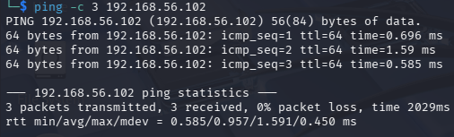

---

## 🔎 2️⃣ Enumeração Inicial

Foi realizada varredura para identificar serviços ativos.

### Serviços identificados:
- FTP (porta 21)
- SSH (porta 22)
- SMB (porta 139/445)
- HTTP (porta 80)

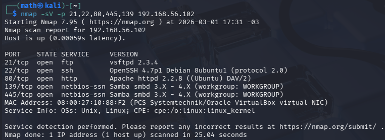

        A enumeração foi essencial para definir os vetores de ataque.

---

## ⚔️ 3️⃣ Ataques Simulados

### 🔹 FTP

Primeiro passo é a criação de wordlists com os seguintes comandos:

    echoe -e 'user/nmsfadmin/nadmin/nroot' > users.txt
    echoe -e '123456/npassword/nqwerty/nmfsadmin' > senhas.txt

Após isso basta executar o comando:

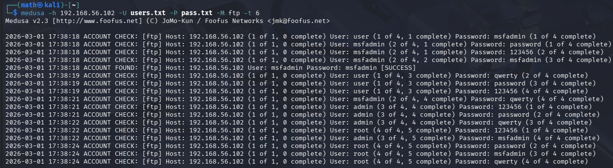

### 🔹 SMB
Para a invasão do SMB é necessário fazer a enumeração de usuários para não haver tentativas desnecessárias com usuários inexistentes para isso vamos utilizar a ferramenta Enum4linux utilizandoos seguintes comandos:

        enum4linux -a 192.168.56.102 | tee enum4_output.txt

E após esse comando

        less enum4_output.txt

Com isso teremos acesso a lista de usuários:

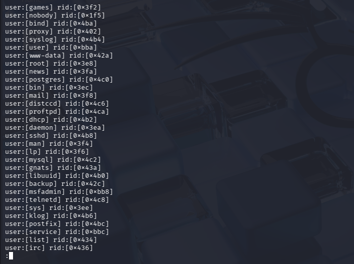

Com a lista de usuários basta criar novas wordlists focadas para esse ataque SMB

    echoe -e 'user/nmsfadmin/nservice' > smb_users.txt
    echoe -e '123456/npassword/nWelcome123/nmfsadmin' > senhas_spray.txt

Após isso basta executar na medusa o seguinte comando

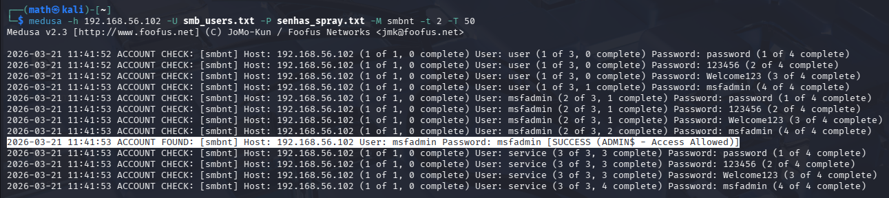

### 🔹 DVWA (Formulário Web)
Para fazer a invasão de um formulário web é necessário fazer diversas verificações para que não haja erro de identificação por parte das ferramentas como pode ser visto na imagem abaixo ao colocar qualquer usuário e senha que sejam incorretas a mensagem Login failed é gerada:

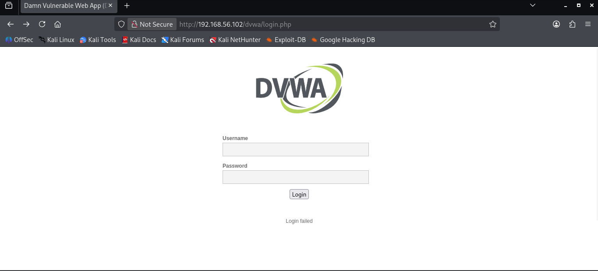

    Muitos formulários com nível de segurança baixo utilizam apenas a mensagem de erro possibilitando ataques como:

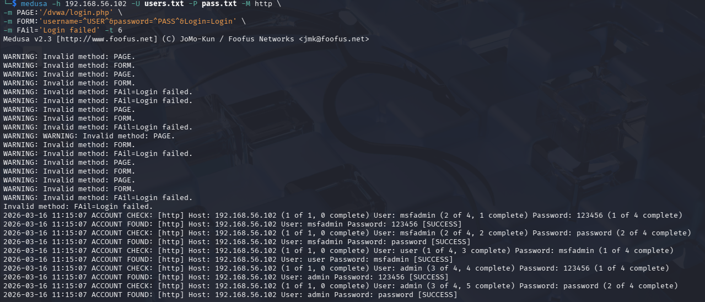

    Porém, como visto acima existe mais um parâmetro que está fazendo a Medusa gerar falsos positivos. Com isso é melhor utilizar o Wireshark para fazer o "snif":

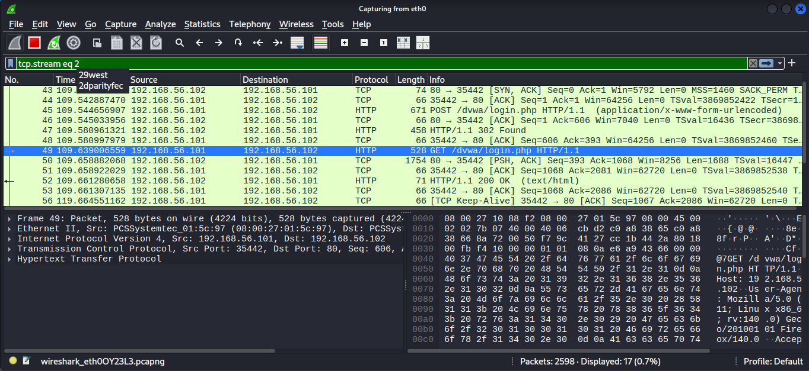

    Com os resultados obtidos temos:

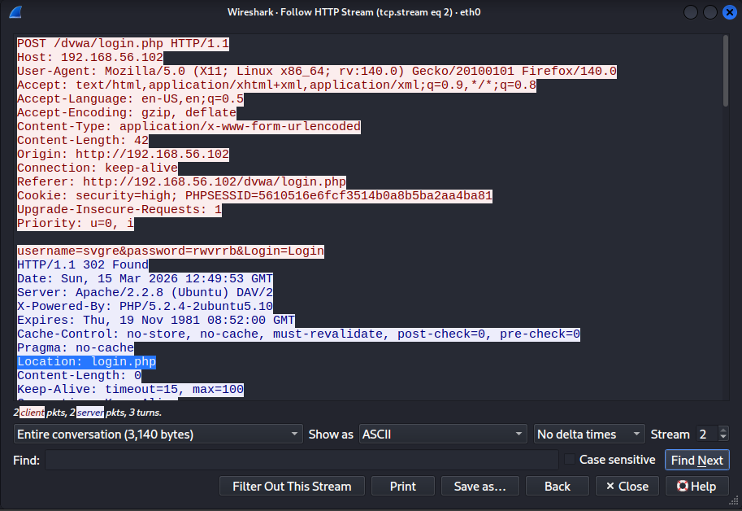

    Com isso, percebe-se que há um redirecionamento possibilitando reescrita do comando utilizando o novo paramêtro:

 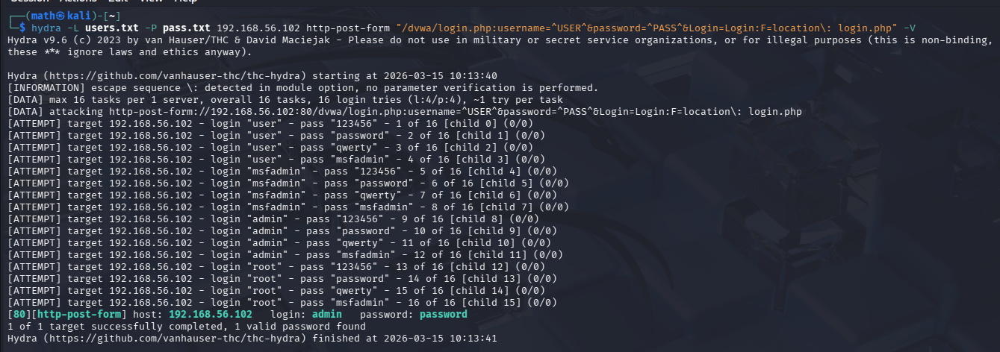

---
### 🔹 Porque utilizar Hydra invés de Medusa 

A ferramenta Hydra é melhor quando se trata de ataque de força bruta em formulário de autenticação Web devido ao seu suporte avançado para formulários HTTP. Diferentemente da Medusa, que é mais adequada para autenticação direta em serviços de rede como SSH e FTP, o Hydra permite definir parâmetros POST, analisar respostas HTTP e detectar padrões de falha ou sucesso, tornando-o mais adequado para ataques contra aplicações web.

## 🔓 Validação

Após sucesso, os acessos foram validados:

- Login via FTP

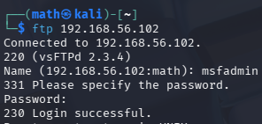

- Listagem de compartilhamentos SMB

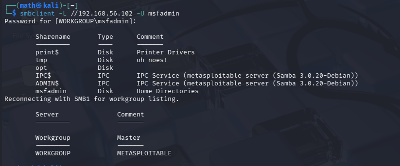

- Acesso ao painel DVWA

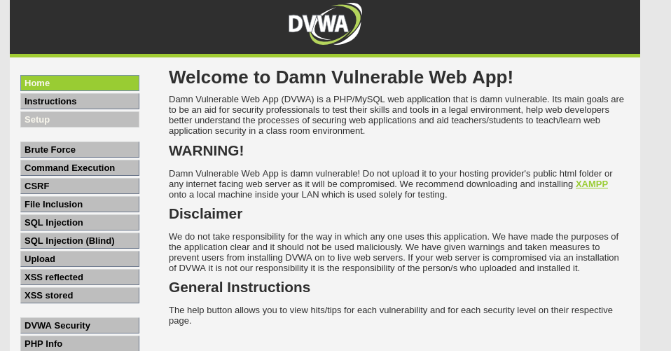

Evidências disponíveis na pasta `/images`.

---

## 🛡️ Análise Técnica

### Por que o ataque funcionou?

- Senhas fracas
- Ausência de bloqueio por tentativas
- Serviços desnecessários expostos

### Funcionaria em ambiente corporativo moderno?

Provavelmente não da mesma forma, pois ambientes reais utilizam:

- Rate limiting
- Bloqueio de conta
- Monitoramento de logs

---

## 📚 Principais Aprendizados

- Importância da enumeração
- Funcionamento real de brute force
- Impacto de credenciais fracas
- Necessidade de políticas de segurança adequadas

---

# ⚠️ Aviso Legal

**Todos os testes foram realizados em ambiente controlado e autorizado para fins exclusivamente educacionais.**